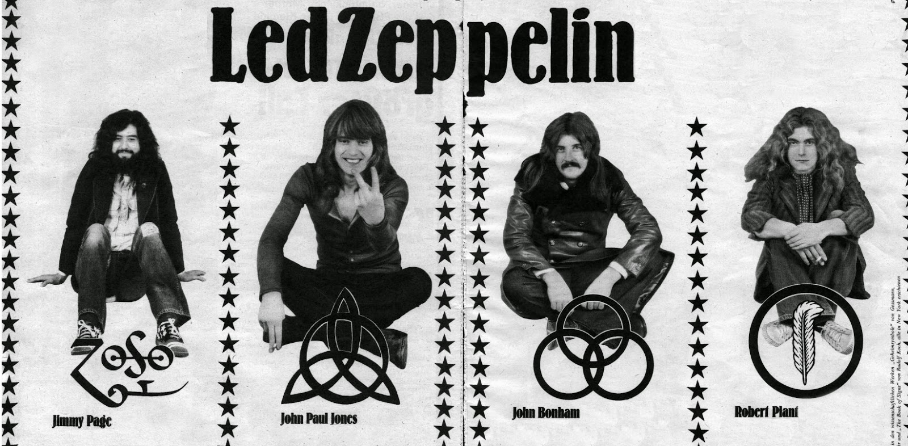

# Aula 02 do Módulo 02

#### Utilização de tags básicas de HTML para fins de estudo

##### Código fonte do exercício:

<!DOCTYPE *html*>
<html *lang*="pt-br">
  <head>
        <meta charset="UTF-8">
​    <title>A melhor banda de todos os tempos</title>
  </head>
  <body *style*="background: #000 url(hermit.jpg) no-repeat; background-size: 100% 100%; font-family: Cambria, Cochin, Georgia, Times, 'Times New Roman', serif;">
​    <header>
​      <h1 *style*="color: #fff;">LED ZEPPELIN - OS DEUSES DA MÚSICA!</h1>
​    </header>
​      
​    <section *style*="width: 60%;word-wrap: break-word;">
​      <h2 *style*="color: #fff;">Led Zeppelin e Eu</h2>
            <p style="color: #fff;">
​        Falar de Led Zeppelin para mim sempre foi muito fácil. Esta banda maravilhosa entrou na minha vida desde que me entendo por gente. Meu pai sempre ouvia o álbum "Led Zeppelin - IV" e quando consegui entender o que eu estava ouvindo, foi uma paixão para o resto da vida. E hoje sempre que ouço, me trás um significado diferente de quando era pequeno, além do prazer de escutar me trás também a lembrança do meu velho, que me faz tanta falta.
​      

​       
​      <h3 *style*="color: #fff;">Um pouco de história</h3>
            <p style="color: #fff;">
​        Led Zeppelin foi uma banda britânica de rock formada em Londres, em 1968. Consistia no guitarrista Jimmy Page, no vocalista Robert Plant, no baixista e tecladista John Paul Jones e no baterista John Bonham. Seu som pesado e violento de guitarra, enraizado no blues e música psicodélica de seus dois primeiros álbuns, é frequentemente reconhecido como um dos fundadores do heavy metal. Seu estilo foi inspirado em uma grande variedade de influências, incluindo a música folk, psicodélica e o blues. 
​      

​       
​      <h4 *style*="color: #fff;">Formação:</h4>
​      <ul *style*="color: #fff;">
​        <li>Vocais: Robert Plant</li>
​        <li>Guitarra: Jimmy Page</li>
​        <li>Baixo e Piano: John Paul Jones</li>
​        <li>Bateria: John Bonham</li>
​      </ul>
​        
​      <h4 *style*="color: #fff;">
​        Se você não conhece, deveria conhecer!  
​        E se já conhece, aumenta o som e aproveita!
​      </h4>  
​    </section>
​    <footer>
            <a href="https://www.ledzeppelin.com/?frontpage=true" target="_blank">
                
​      </a>
​    </footer>
  </body>
</html>